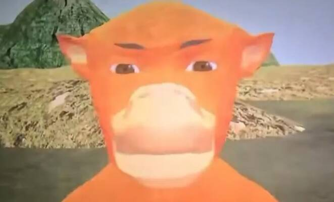

# 呂皓翔

## 關於我

我是呂皓翔，是一名大學生。

### 我的技能

- **電腦操作**
- 溝通
- 團隊合作

*我的座右銘：我沒有。*

### 喜歡的網站

[YouTube](https://www.youtube.com/)

### 圖片



> 努力做好每一件事。

### 教育背景

| 階段 | 經歷 |
|---|---|
| 高中職 | 高職畢業 |
| 大學 | 就讀中 |

### Python

```python
print("Hello, 我的名字是呂皓翔")
```
